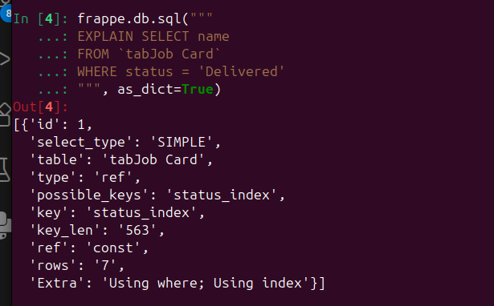

B1 - Trace a Request End-to-End 
Step 1  Routing
 /api/method/quickfix.api.get_job_summary - In this the server calls the get_job_summary() method defined in api.py file. Frappe finds it by application function defined in frappe/app.py it handles if the api url starts with api/ it sends the request to frappe/api/init.py. The method routes to the whitelisted method by the dotted path and returns the json response.

 /api/resource/Job Card/JC-2024-0001 - In this api/resource fetch the data from the doctype, given in the url-Job Card. It fetches the details of JC-2024-0001. But frappe calls it internally. When we need to access JC-2024-0001 in desk, the request will send as this api/method/frappe.desk.form.get_doc?doctype=Job&Card. Because it not only need the data, it also checks permissions.

 /track-job - it is website route it tells open the track-job list
 Step 2 - Session & CSRF
    x-csrf token is 4d55818c1003edb7ecc097b0a67b596cd5a147672dcac4d86dc3376a
frappe creates csrf token during login to the site, for each login different token are generated. In console using frappe.csrf_token we can find the token. If there is no csrf token there may be a chance of malcious attack in the site from other site. Once after login session id is created, now If we visit any malcious site and enter our site if takes our session ID but not the csrf, so It prevents the attack from other sites.

    In [2]: frappe.session.data
    Out[2]: {}
    Because in bench console there is no session ID, no login so it is empty.

Step 3 - Error visibility
    With developer mode - For the exception eg. 1/0 zerodivision error it shows server error 500 uncaught exception with show error button when clicked It can be tracebacked.
    Without developer mode - The page shows site cant be reached.

    With developer mode = 0, too observed the samething, it browser shows show error button and also login as different user it shows the same. BEcause we run this in localhost.

    In production the error will available in the logs folder under a specific files example: scheduler error in scheduler.log from here developer can tracback.

Step 4 - Permission check location
    In a whitelisted method, call frappe.get_doc("Job Card", name) WITHOUT
    ignore_permissions. Then log in as a QF Technician user who is NOT assigned to
    that job. Answer: It will show the document, because get_doc doesn't check read permission, to check it we need to use check_permission("read"), it will show 403: You do not have enough permissions to complete the action error.
-----------------------------------------------------------------------------------------
B2
Part A - Table naming 
frappe.db.sql("DESCRIBE `tabJob Card`", as_dict=True) 
    - It list all the tables that contain word job.
    - [{'Field': 'name',
        'Type': 'varchar(140)',
        'Null': 'NO',
        'Key': 'PRI',
        'Default': None,
        'Extra': ''},
        {'Field': 'creation',
        'Type': 'datetime(6)',
        'Null': 'YES',
        'Key': 'MUL',
        'Default': None,
        'Extra': ''},]
        Tab prefix - In frappe all the doctypes are stored in db with the name prefix tab example tabJob Card.
frappe.db.sql("DESCRIBE `tabJob Card`", as_dict=True)
    column names- customer name, customer_email, customer_phone, alternate_phone_no,
                  device_type
Part D
    * Docstatus
        0 - Draft
        1 - Submitted
        2 - Cancelled
    * doc.save on a submitted document- No error shown If we simply use a doc.save in a submitted document. But If we edit any field in console and use doc.save throws error.
    * When we use doc.save() on a cancelled document it shows error as 
    ValidationError: Cannot edit cancelled document
    * During overwrite frappe throws error as 
    example: Error: 5o50s1nq0o (test) has been modified after you have opened it 
                    (2026-02-28 19:33:21.239569, 2026-02-28 19:36:18.953297). Please refresh to get the latest document.
        Frappe handles it by, check_latest method in frappe/model/document.py it raises the timestampmismatch exception.
Part - E
    def validate(self):
        self.total = sum(r.amount for r in self.items)
    def on_submit(self):
        other = frappe.get_doc("Spare Part", self.part)
        other.stock_qty -= self.qty
        other.save()
-------------------------------------------------------------------------------------------
C3 - Part Usage Entry & Service Invoice
* Parent - parent document name(eg. JC-2026-00001)
  Parent Type - Parent doctype name (eg. Jobcard)
  Parent field - Field name of child table in parent doctype(eg. parts_used)
  idx - index for each row starts with 1.
* tabPart Usage Entry child table name in db.
* If idx 2 is deleted and saved, the next row if available will set to 2, and so on.
-------------------------------------------------------------------------------------------
D1
bench console: call frappe.get_doc_permissions(doc) on a Job Card
frappe.session.user
'test@gmail.com'
doc = frappe.get_doc("Job Card", "JC-2026-00001")
    ...: get_doc_permissions(doc)
{'if_owner': {},
 'has_if_owner_enabled': False,
 'select': 0,
 'read': 1,
 'write': 1,
 'create': 0,
 'delete': 0,
 'submit': 1,
 'cancel': 0,
 'amend': 0,
 'print': 0,
 'email': 0,
 'report': 0,
 'import': 0,
 'export': 0,
 'share': 0}

 using get_all in whitelist method, any user even the guest user can see the data without permission. But get_list, checks the role permission.
 --------------------------------------------------------------------------------------------
 E-1
 on_update() - demonstrate the recursion pitfall
    Using self.save() in on_update shows Recursion error as {
	"exception": "RecursionError: maximum recursion depth exceeded",
	"exc_type": "RecursionError",
	"_exc_source": "quickfix (app)"
    }
    Because on_update runs after the document saved(), in on update we use self.save() it will executed infinitely. So, the error arises. The correct pattern for update is to use db_set as it will update in database as well.

E2 - autoname & Renaming
    using frappe.rename_doc to change the name of a document, the linked field is also gets updated it is handled in frappe/model/rename_doc.py in update_link_field method, it first fetch the available link field and passed as arguments to the update_link_field_values()

    merge=True can be used to combine both documents eg. TECH-0001 to TECH-0002, But there will be a loss of data from TECH-0001

E3 -
Part B - Upgrade friction analysis:
    * If we didn't call super.validate() the function we written in the parent class JobCard
    won't gets executed.
    * doc_events are safer because it didn't change the controller.
Part C - Controller method for Spare Part
    def on_update(self):
		doc = frappe.get_doc("QuickFix Settings", "QuickFix Settings")
		threshold = doc.low_stock_alert_enabled
		threshold = frappe.db.get_value("QuickFix Settings", None, "low_stock_alert_enabled")
		
        as per the task only a singlr value os retrived So, it is best to use get_single_value. If we use get_doc It will take all the fields in the object.
---------------------------------------------------------------------------------------------
F1 - doc_events: Wildcard, Multiple Handlers, Order 
Task B - Multiple handler conflict:
    * If validate is written in both controller and handler, the controller will gets executed first. When error both raises error, the controller will throw first and stops the handler function.
    * When using "*" and a specific event in doc_event, both gets executed.

F3 - Asset, Jinja & Website Hooks 
Asset hooks:
    app_include_js -> is used to load the js file for the desk apps.
                        eg. job card
                    it can be used for navbar, custom buttons etc.
    web_include_js -> is used to load the js file for the website.
                        eg. localhost:8000/about
                    It is used to create web page designs like adding contents to about contact page.
    doctype_js -> This is used to perform action inside/opening a document.
    doctype_list_js -> This is used to perform action in the form list view.

     cache-busting -> To improve the performance, browser cache the js scripts, If we do any modification in the js code, the changes are not known to the browser still it holds the old file. To avoid this we use "bench build" it will rebuild the asset and the file will be updated.
Jinja Hooks:
    jinja context in print format - here the document is default,
                                    eg. in Job Card JC-2026-00001, customer name=Ajish
                                        in print format {{doc.customer_name}}
    jinja context in webpages - here the document is not default, So, we need to privide
                                value to the variable.
                                eg. context.shop="Quickfix"

F4 - override_whitelisted_methods Hook 

override_whitelisted_method -> this can be used to modif one apps method to other without  
                               changing or editing the actual code.
monkey_patch - It is used to modify the function in runtime, and it is difficult to debug.

If TWO apps override the same method, the hooks work in the apps installation order. And the last insatlled app will override and remaining will not override.

signature mismatch - It mean, the number of parameters in original method and override
                     method must be same, else error will be shown.

F5 - Fixtures & Property Setters in Install
    If user create a custom field with existing field name, frappe throws error as Duplicate column.
    Patches Order must be separate, because if one patch create field and other reads it, it will be done in order. Patch 2 thinks the field already exist, if we combine both there wont be a time to refresh and error as unknown column.
---------------------------------------------------------------------------------------------
G1 - Safe Monkey Patch with Version Guard
* _qf_patched is for safety purpose, if not used the patch will run multiple times, it is used to run the patch one time.
* If patch is written in __init__.py, if runs when ever the module is imported, this cause the patch code to execute multiple times, to avoid this we write it in separate file.
* doc_events - override_doctype_class - override_whitelisted_method - monkey_patch, is the safest order because, 
    doc_events - don't modify the framework code.
    override_doctype_class - change the logic of a specific doctype.
    override_whitelisted_method - override specific framework API method.
    monkey_patch - changes the framework methods logic.
--------------------------------------------------------------------------------------------H1 - Job Card Form Script
    * Using frappe.call is synchronous, if we write inside validate(), before the server sends response the validate function will finshed and form saved.
    However the response is arrived, it will execute the call back, but if validation finshed and if the document is saved, and the response may be "Invalid Job card" it breaks the logic.

    * onload or refresh is safe because it controls the ui updates doesn't control the save process.
H3 - List View & Tree View
    * Tree Doctype:
        Tree doctype shows hiearchial order, where parent-child relationship between documents. 
        eg. Warehouse - Parent
            |-section A - Child
            |-section B - Child
H4 - Client Script DocType vs Shipped
    * Client Script - It is a client script doctype, inside frappe site where we can select the doctype, module and write the client script for the selected Doctype. It is suitable for simple validations.We can use fixtures, to get the code in app file. As it is not version controlled, It is hard to debug.
    * Shipped Script - It is the js file created for each doctype. The code here can be pushed to git, and easy to maintain.Used for large validation code.

    * hiding fields vs permission security:
    Hiding done in client script will be hidden only in UI. It does'nt check permission. It can be accessed with api methods. Becaues it runs only in browser, for safety It must be handled in the server side.
--------------------------------------------------------------------------------------------
I1 - Query Report with SQL Safety
    * f string, sql cannot differentiate between user input and query, So attacker can modify the query.
    * If we use parameterized, the input will be considered as data, not query.

    Safe:
    In [8]: device = "' OR 1=1#"
    ...: query = """
    ...: SELECT name, device_type
    ...: FROM `tabJob Card`
    ...: WHERE device_type = %(device)s
    ...: """
    ...: frappe.db.sql(query, {"device": device}, as_dict=True)
    Out[8]: []
    frappe.db.sql(query, {"device": device}, as_dict=True) is the safest method, it returns [] if the device is empty.
    But using, f it will give all the Jobcard name and device_type

    Unsafe:
    In [3]: device = "' OR 1=1#"
   ...: 
   ...: query = f"""
   ...: SELECT name, device_type
   ...: FROM `tabJob Card`
   ...: WHERE device_type = '{device}'
   ...: """
   ...: print(query)
   ...: frappe.db.sql(query, as_dict=True)

    If the input is "", it list all the jobcards.

    search_index:
    
--------------------------------------------------------------------------------------------
I4 - Prepared Report
Realtime-Script report is used for updated report with small amount of data, and simple calculations. Prepared report is for large data, complex calculations as it requires workers to run in background.
---------------------------------------------------------------------------------------------
J1 - Jinja Print Format: Job Card Receipt 

In Frappe transalation of a print format, the field must be wrappe with {{_("test")}}, and the translation, priority will be based on the User's Language given in User Details.
Next, Language selected from print format and next the systems default Language. If any Translation Language not found, it automatically use English.

Using get_all directly inside jinja template, will return the result. But it is hard to debug and also slower when compare to before_print method. Using before_print will run the get_all and stores the data, during print with shows the data fetched already. So it is comparatively faster as compared to using get_all directly in jinga template.
